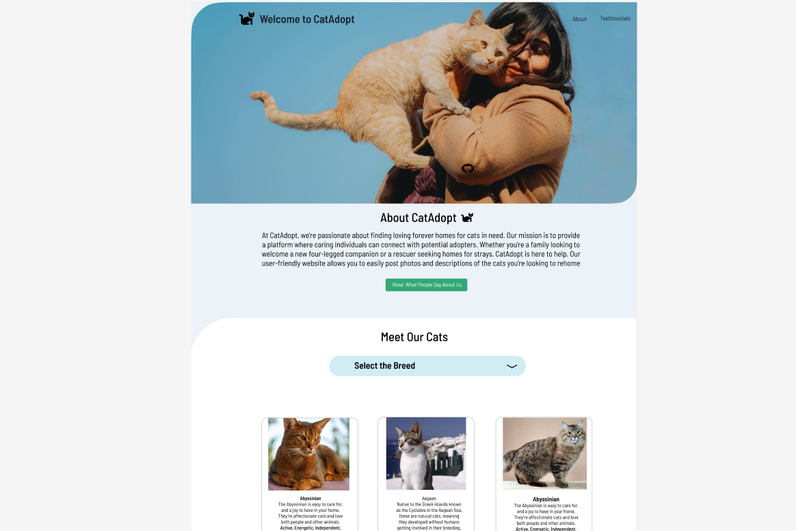

# SBA 326 and SBA308A

## About The Project
This CatAdoption website aims to find loving forever homes for cats in need. This project provides a platform where individuals can easily connect and facilitate the adoption of cats in need of loving homes. The website features two main pages: a homepage and a comments page.

## Features

- **Homepage**: The homepage showcases a section where users can see cats that are need of home. They can search cats by breed and there is also a button that navigates to the testimonials page.
- **Testimonials Page**: This page displays testimonials from users who have successfully adopted cats through the platform.
- **Cat API Integration**: The website utilizes the CatAPI to fetch random cat images and display them on the homepage, adding a touch of cuteness to the user experience.
- **Comment System**: Users can leave testomonials and the will be posted on the testomonial page.
- **Responsive Design**: The website is built with bootstrap, ensuring a good experience across different screen sizes.

### Built With
| Technology | Description                               | 
|------------|-------------------------------------------|
| HTML       | Structuring the website's content and layout.          | 
| CSS        |  Styling the website's appearance and layout.                | 
| JavaScript | Implementing interactivity, handling user events, and making API calls.| 
| Figma | A design tool used for creating wireframes and prototypes during the planning phase.| 
| JavaScript | Implementing interactivity, handling user events, and making API calls.| 
 

## API Used

- **CatAPI**: A third-party API that provides random cat images and data.

Please click to know more about this API[here](
https://thecatapi.com/ ) to find check the website.

## Figma
The design and prototy for this project can be found in the following link: [Clickhere](
https://www.figma.com/design/HppZrHoPhdQoNhZBQTQ1NP/CatAdopt?node-id=0-1&t=RZhSzsQ7NN4RCaSI-1 )

